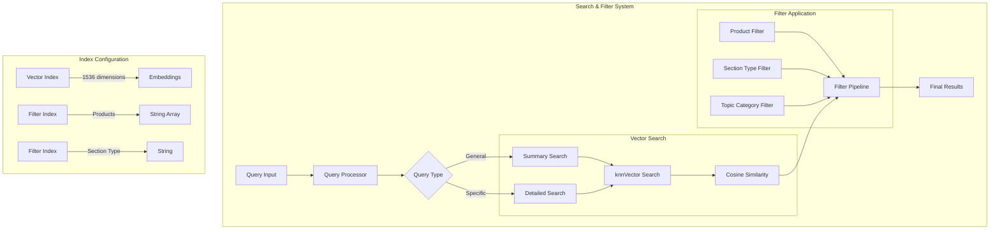

```mermaid
graph TD
    subgraph "Search & Filter System"
        A[Query Input] --> B[Query Processor]
        
        B --> C{Query Type}
        C -->|General| D[Summary Search]
        C -->|Specific| E[Detailed Search]
        
        subgraph "Vector Search"
            D --> F[knnVector Search]
            E --> F
            F --> G[Cosine Similarity]
        end
        
        subgraph "Filter Application"
            H[Product Filter] --> I[Filter Pipeline]
            J[Section Type Filter] --> I
            K[Topic Category Filter] --> I
        end
        
        G --> I
        I --> L[Final Results]
    end

    subgraph "Index Configuration"
        M[Vector Index] -->|1536 dimensions| N[Embeddings]
        O[Filter Index] -->|Products| P[String Array]
        Q[Filter Index] -->|Section Type| R[String]
    end
```
