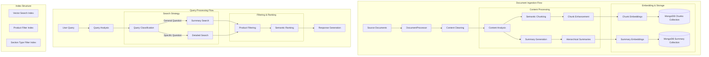

```mermaid
graph TD
    subgraph "Document Ingestion Flow"
        A[Source Documents] --> B[DocumentProcessor]
        B --> C[Content Cleaning]
        C --> D[Content Analysis]
        
        subgraph "Content Processing"
            D --> E[Semantic Chunking]
            D --> F[Summary Generation]
            E --> G[Chunk Enhancement]
            F --> H[Hierarchical Summaries]
        end
        
        subgraph "Embedding & Storage"
            G --> I[Chunk Embeddings]
            H --> J[Summary Embeddings]
            I --> K[(MongoDB Chunks Collection)]
            J --> L[(MongoDB Summary Collection)]
        end
    end

    subgraph "Query Processing Flow"
        M[User Query] --> N[Query Analysis]
        N --> O[Query Classification]
        
        subgraph "Search Strategy"
            O -->|General Question| P[Summary Search]
            O -->|Specific Question| Q[Detailed Search]
        end
        
        subgraph "Filtering & Ranking"
            P --> R[Product Filtering]
            Q --> R
            R --> S[Semantic Ranking]
        end
        
        S --> T[Response Generation]
    end

    subgraph "Index Structure"
        U[Vector Search Index]
        V[Product Filter Index]
        W[Section Type Filter Index]
    end
```
