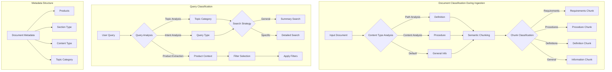

```mermaid
graph TD
    subgraph "Document Classification During Ingestion"
        A[Input Document] --> B{Content Type Analysis}
        B -->|Path Analysis| C[Definition]
        B -->|Content Analysis| D[Procedure]
        B -->|Default| E[General Info]
        
        C --> F[Semantic Chunking]
        D --> F
        E --> F
        
        F --> G{Chunk Classification}
        G -->|Requirements| H[Requirements Chunk]
        G -->|Procedures| I[Procedure Chunk]
        G -->|Definitions| J[Definition Chunk]
        G -->|General| K[Information Chunk]
    end

    subgraph "Query Classification"
        L[User Query] --> M{Query Analysis}
        M -->|Topic Analysis| N[Topic Category]
        M -->|Intent Analysis| O[Query Type]
        M -->|Product Extraction| P[Product Context]
        
        N --> Q{Search Strategy}
        O --> Q
        P --> R[Filter Selection]
        
        Q -->|General| S[Summary Search]
        Q -->|Specific| T[Detailed Search]
        R --> U[Apply Filters]
    end

    subgraph "Metadata Structure"
        V[Document Metadata] --> W[Products]
        V --> X[Section Type]
        V --> Y[Content Type]
        V --> Z[Topic Category]
    end
```
