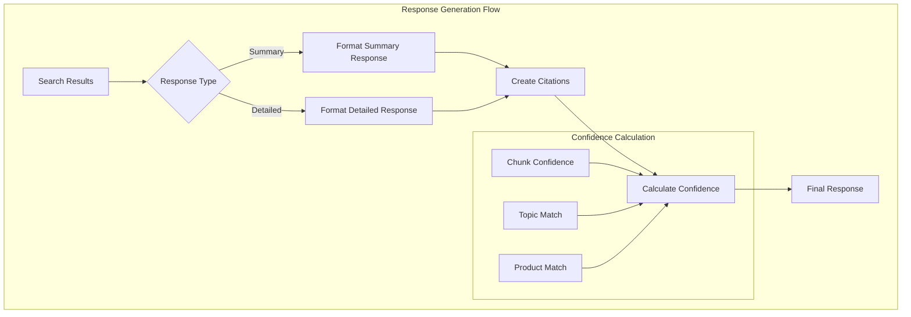

```mermaid
graph TD
    subgraph "Response Generation Flow"
        A[Search Results] --> B{Response Type}
        B -->|Summary| C[Format Summary Response]
        B -->|Detailed| D[Format Detailed Response]
        
        C --> E[Create Citations]
        D --> E
        
        E --> F[Calculate Confidence]
        F --> G[Final Response]
        
        subgraph "Confidence Calculation"
            H[Chunk Confidence] --> F
            I[Topic Match] --> F
            J[Product Match] --> F
        end
    end
```
